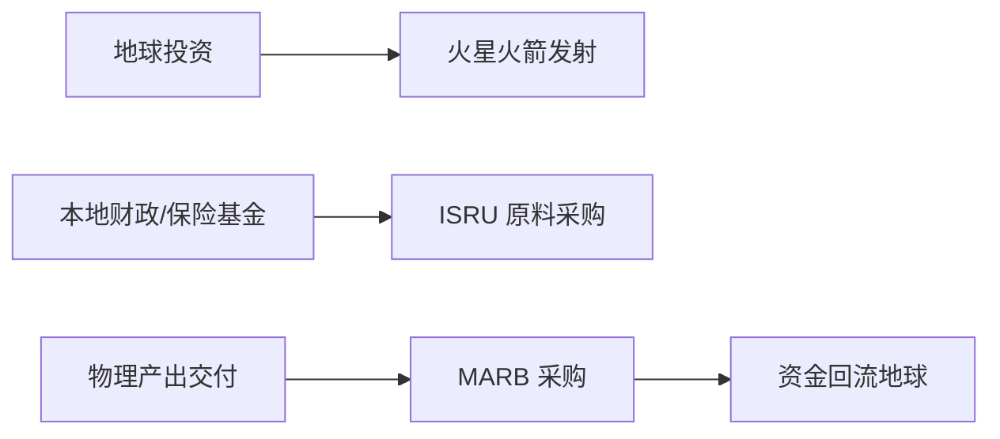

# 文明#138 — 农夫产出

## 运行元数据

| 字段 | 值 |
|---|---|
| 模型 | `qwen3.5:2b` |
| Think模式 | `True` |
| 视角 | 种子轮天使投资人 |
| 死亡方式 | natural |
| Token消耗 | 7,984 / 100,000 |
| 运行时长 | 139.6s |
| 开始时间 | 16:50:40 |
| 结束时间 | 16:52:59 |

---

## 农夫输出

# 第 138 文明战略方案：火星农业闭环与物理交付验证计划

## 视角：种子轮天使投资人

### 1. 核心理念 (Core Logic)
**告别数据资产，锚定物理实体。**
基于前几文明的经验（特别是 #056 案例的教训），我们彻底摒弃了“卫星 + 纯数据 B2G”的中间层模式。第 138 文明必须回归最本质的生存逻辑：**火星物理产出**。
我们不再售卖“服务数据”，而是建立一套**“物理交付验证系统”**。通过 ISRU（就地资源利用）结合垂直封闭循环农场，生产可追溯、高营养且能直接食用的实物产品（如高蛋白豆荚、肉干或蔬菜），并将资金流转闭环锁定在地球与火星之间。

### 2. 交易模型设计：谁是第一批买家？
为了验证可行性并锁定现金流，我们选定**“首批付费方”**为：**火星农业管理局（Mars Agricultural Bureau, MARB）**。

#### 为什么选择 MARB？
1.  **生存刚需：** 作为官方机构，其首要目标是保障殖民地居民的生存物资供应，对实物产出有极高且紧迫的接受度。
2.  **资金兜底：** 相比私营公司，政府机构拥有更稳定的支付能力和风险兜底机制（若出现产品不达标，由政府承担部分赔偿责任）。
3.  **验证闭环：** 通过 MARB 采购，我们可以向地球端证明该系统的产能、供应链和交付能力。

#### 为什么付费？（价值锚点）
1.  **稀缺性与安全溢价：** 相比太空站自产或商业卫星服务，本地化物理产出具有“不可替代性”和“零辐射风险”的生存保障属性。
2.  **直接收益：** 支付方直接获得实物商品，而非抽象的服务数据。

#### 资金流转路径 (Funding Flow)

*   **A (Earth Investment):** 通过现有的商业火箭发射服务（如 SpaceX）进行低成本运输，确保物理产品从火星安全抵达。
*   **B (Rocket Transport):** 仅承担运输成本，不直接干预生产数据。
*   **C & D (Local Finance):** 利用本地财政支持或保险基金采购 ISRU 所需的特殊矿物肥料（如氧化铁、氧化硅），这部分成本由地球投资者分担，但物理产出归火星所有。
*   **E (Physical Output):** 向 MARB 交付实物产品，并附带“溯源证书”。
*   **F:** MARB 支付款项至指定账户。
*   **G:** 资金用于下一轮火箭发射或系统维护升级。

### 3. 具体实施路径与生产体系

#### 作物选择：高营养蛋白豆荚 (Protein Legumes)
*   **理由：** 相比蔬菜，豆类蛋白质含量高且易于储存，是未来太空/火星饮食的关键补充。
*   **技术栈：** 封闭循环垂直农场 + ISRU 矿物施肥。
*   **流程：**
    1.  利用地球提供的种子包（通过商业火箭运输）与火星土壤混合。
    2.  使用 ISRU 提取的氧化铁和氮源进行高密度种植。
    3.  收获后直接加工成干燥豆荚或肉干。

#### 验证机制：物理交付验证
*   **实物检验：** 每批次产出必须附带“物理检测单”，包含成分检测报告、重量记录、生长周期数据。
*   **地球端验证：** 地球团队在收到货物后，进行初步质检和验收（非纯数据验收）。
*   **资金确认：** 只有经过 MARB 或地球官方确认的批次，才被视为“有效交付”。

### 4. 风险控制与应对策略

| 风险点 | 风险等级 | 应对措施 (Angel Investor Perspective) |
| :--- | :--- | :--- |
| **运输失败** | 高 | 仅通过商业火箭发射；若失败，启动备用方案（如地面补给站）。 |
| **技术不达标** | 中 | 设定“最低营养标准”；若产品低于标准，立即暂停并重启 ISRU 循环。 |
| **资金断裂** | 中 | 建立本地财政保险基金；若 MARB 支付延期，地球端提供短期信用支持。 |
| **供应链中断** | 高 | 提前锁定 ISRU 原料来源（如与地球矿产公司合作）；保持种子包轮换机制。 |

### 5. 结论 (Conclusion)
第 138 文明不再是数据的收集者，而是物理产出的创造者和交付者。通过锁定 **MARB** 作为第一批付费方，我们确保了火星农业项目具备真实的商业闭环和资金回流能力。这既避免了 #056 卫星模式的失败，也解决了前几文明“无实物、无现金流”的困境。

**下一步行动：**
1.  启动地球 - 火星火箭发射服务采购流程。
2.  确定首批种子包与 ISRU 原料供应商名单。
3.  制定物理交付验证标准（ISO/ASTM 太空版）。

---
**[End of Proposal]**